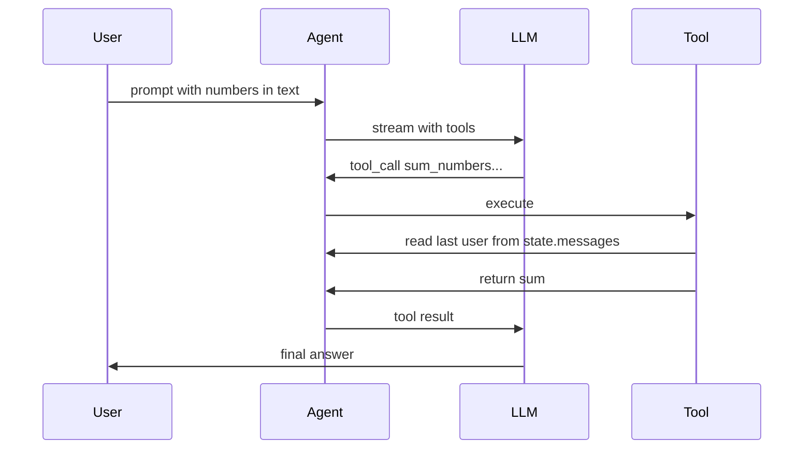

# Simple pi-mono agent with “sum numbers in last user message” tool

## Goal

- New Node/TypeScript app (ESM) under `[/home/yogibear54/Projects/lotus-creations.com/_PROJECTS/simple-agent](file:///home/yogibear54/Projects/lotus-creations.com/_PROJECTS/simple-agent)`.
- One experimental tool: when invoked, it **sums every numeric literal** appearing in the **most recent `user` message** in the agent’s message history (your selected scope).
- Use the official stack: `**Agent`** from `@mariozechner/pi-agent-core`, `**getModel`** from `@mariozechner/pi-ai`, `**Type`** from `@sinclair/typebox` for tool parameters.

## Why register tools after `Agent` construction

The tool’s `execute` handler needs to read `agent.state.messages` to find the last user message. The `[packages/agent` README]([https://github.com/badlogic/pi-mono/blob/main/packages/agent/README.md](https://github.com/badlogic/pi-mono/blob/main/packages/agent/README.md)) pattern is to use `agent.setTools([...])` after the `Agent` exists so the tool closes over the same `agent` instance (avoids circular construction issues).

## Implementation sketch

1. **Project scaffold**
  - `package.json`: `"type": "module"`, scripts `build` / `start` (or `tsx` for dev), dependencies:
    - `@mariozechner/pi-agent-core`
    - `@mariozechner/pi-ai`
    - `@sinclair/typebox`
    - `typescript`, `@types/node` (and optionally `tsx` for running without a separate build step).
  - `tsconfig.json`: NodeNext or ES2022 + `"moduleResolution": "bundler"` or `"NodeNext"` consistent with ESM.
2. **Number extraction**
  - Add a small pure function, e.g. `extractNumbersFromText(text: string): number[]`, using a regex that matches integers and decimals (e.g. `-?\d+(\.\d+)?`) and `Number()` / `parseFloat` with validation so non-numeric edge cases are skipped.
  - **Normalize user content to string**: last message with `role === "user"` may have `content` as a string or structured parts; handle both (if array, concatenate `text` parts per pi-ai conventions).
3. **Tool definition (`AgentTool`)**
  - `name`: e.g. `sum_numbers_in_last_user_message`
  - `parameters`: `Type.Object({})` (no args—the behavior is fully defined by conversation state).
  - `execute`: locate the **last** message where `role === "user"` in `agent.state.messages`, stringify content, run extraction, return `sum` in `content` as text and optional `details: { numbers: number[], sum: number }` for debugging.
4. **Agent wiring**
  - `new Agent({ initialState: { systemPrompt: "...", model: getModel(...), tools: [] } })` then `agent.setTools([sumTool])`.
  - `agent.subscribe` to print `text_delta` chunks (same pattern as upstream quick start).
  - `await agent.prompt("...")` with a user message that contains several numbers so the model can call the tool (system prompt should explicitly tell the model this tool exists and when to use it).
5. **Credentials**
  - Document required env vars for the chosen provider (e.g. `ANTHROPIC_API_KEY` if using Anthropic). Match whatever `getModel("anthropic", ...)` expects in pi-ai (user sets keys locally; no secrets in repo).
6. **Optional follow-up (out of scope unless you ask)**
  - CLI args for the prompt, or `readline` for interactive use.

## Files to add (expected)

| Path                             | Purpose                              |
| -------------------------------- | ------------------------------------ |
| `[package.json](package.json)`   | Dependencies and scripts             |
| `[tsconfig.json](tsconfig.json)` | TS + ESM settings                    |
| `[src/index.ts](src/index.ts)`   | Agent, tool, extraction helper, demo |
| `[.gitignore](.gitignore)`       | `node_modules`, `dist`, env files    |

## Flow (mermaid)

## Risks / notes

- **Model must support tool calling** (pi-ai README states the library targets tool-capable models).
- If the model does not call the tool, the system prompt should be explicit: “When asked about sums of numbers in the user’s message, call `sum_numbers_in_last_user_message`.”

